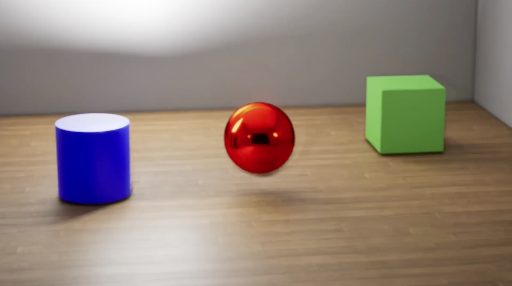

# Physically Based Rendering Study

This project presents a physically based rendering (PBR) study developed in Unreal Engine 5.

## Features
- Physically accurate metal and wood materials
- Cinematic lighting setup
- Controlled exposure (EV100 locked)
- CineCameraActor configuration
- 20-second cinematic render

## Technical Setup
- Unreal Engine 5
- Aperture: f/16
- Exposure locked (Min/Max EV100 = 4)
- RectLight + Directional Light configuration
- Anti-aliasing configured in Movie Render Queue

The final result is a cinematic render showcasing realistic material response and lighting behavior according to PBR principles.

## Screenshots

### Close-up Material Detail

### Mid Composition

### Full Scene Composition

## Author
Alfredo Carta  
Computer Graphics Final Exam  
Roma Tre University
